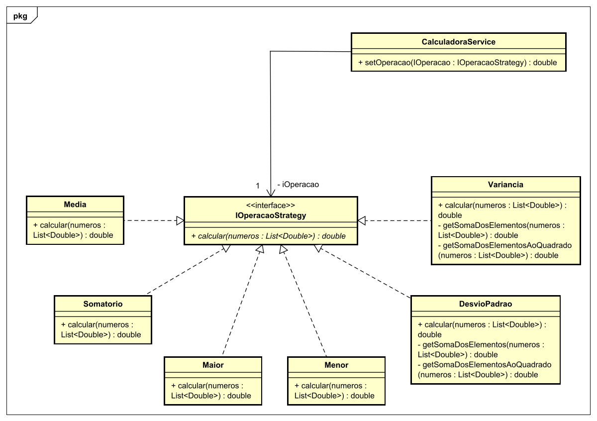

# Refatoração do Código de Estatística com Padrões de Projeto

## Instrução da Atividade

Considere o código-fonte abaixo, que calcula estatísticas como média, somatório, maior valor, menor valor, variância e desvio padrão. O objetivo é aplicar um padrão de projeto para alcançar o Princípio do Aberto-Fechado (*Open-Closed Principle*), permitindo a adição de novos cálculos estatísticos sem modificar o código existente.

### Código Original

```java
import java.util.ArrayList;
import java.util.Collections;

public class Estatistica {
    public static final int MEDIA = 0;
    public static final int SOMATORIO = 1;
    public static final int MAIOR = 2;
    public static final int MENOR = 3;
    public static final int VARIANCIA = 4;
    public static final int DESVIOPADRAO = 5;
    static ArrayList<Double> meusNumeros;

    public static double calcula(int op, ArrayList<Double> numeros) {
        if (op == Estatistica.MEDIA) {
            double total = 0;
            for (int i = 0; i < numeros.size(); i++) {
                total += numeros.get(i);
            }
            return total / numeros.size();
        } else if (op == Estatistica.SOMATORIO) {
            return getSomaDosElementos(numeros);
        } else if (op == Estatistica.MAIOR) {
            return Collections.max(numeros);
        } else if (op == Estatistica.MENOR) {
            return Collections.min(numeros);
        } else if (op == Estatistica.VARIANCIA) {
            double p1 = 1 / Double.valueOf(numeros.size() - 1);
            double p2 = getSomaDosElementosAoQuadrado(numeros) - 
                        (Math.pow(getSomaDosElementos(numeros), 2) / Double.valueOf(numeros.size()));
            return p1 * p2;
        } else if (op == Estatistica.DESVIOPADRAO) {
            double p1 = 1 / Double.valueOf(numeros.size() - 1);
            double p2 = getSomaDosElementosAoQuadrado(numeros) - 
                        (Math.pow(getSomaDosElementos(numeros), 2) / Double.valueOf(numeros.size()));
            return Math.sqrt(p1 * p2);
        } else {
            throw new IllegalArgumentException();
        }
    }

    private static double getSomaDosElementosAoQuadrado(ArrayList<Double> numeros) {
        double total = 0;
        for (int counter = 0; counter < numeros.size(); counter++) {
            total += Math.pow(numeros.get(counter), 2);
        }
        return total;
    }

    private static double getSomaDosElementos(ArrayList<Double> numeros) {
        double total = 0;
        for (int counter = 0; counter < numeros.size(); counter++) {
            total += numeros.get(counter);
        }
        return total;
    }
}
```

# Solução Proposta

A solução aplica o padrão de projeto **Strategy** para atender ao Princípio do Aberto-Fechado. O código foi refatorado para que novos cálculos estatísticos possam ser adicionados sem alterar o código existente.

## Estratégia Utilizada

- **Strategy Pattern**: Cada cálculo estatístico é encapsulado em uma classe concreta que implementa uma interface comum.

## Estrutura de Classes



## Vantagens da Solução

- **Extensibilidade**: É possível adicionar novos cálculos apenas criando novas classes de cálculo e as integrando na cadeia.
- **Aderência ao Open-Closed Principle**: Não é necessário modificar as classes existentes para adicionar novas funcionalidades.
- **Manutenção**: Código modular e organizado, com responsabilidades bem definidas.